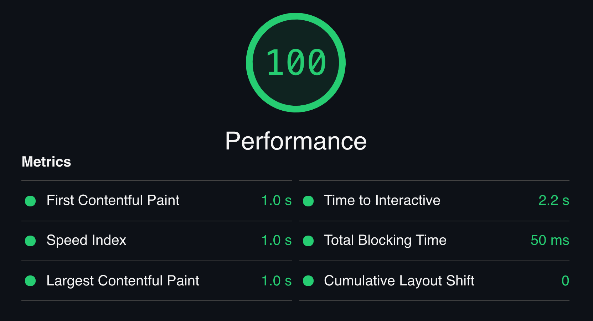

# Gatsby + Outsmartly demo app

### [Live Demo](https://outsmartly-gatsby-demo-app.outsmartly.app/)

This demo requires [Outsmartly](https://www.outsmartly.com/features), a new way of using [Edge Slice Rerendering](https://www.youtube.com/watch?v=W-tBI_n0m_w) to dynamically re-render only tiny slices of your application, leading to blazing speeds while keepign dynamic content such as Personalization and A/B Testing.

## If you'd like access, please sign up here: https://www.outsmartly.com/signup

This is a fake company ("TaskMallard") landing page using Gatsby combined with Outsmartly. It demonstrates [Edge Slice Rerendering](https://www.youtube.com/watch?v=W-tBI_n0m_w) for doing personalization based on the visitor's location and device type (e.g. mobile/desktop), as well as doing A/B testing at the same time.

<p align="center">
  
  
</p>

## Project Tour

### [src/pages/index.js](src/pages/index.js)

This page is a good starting point to get a feel for the code.

We've broken out many things in this project into reusable [components](src/components/). A majority of the CSS comes from Bootstrap, which is customized in our [src/pages/index.scss](src/pages/index.scss) file.

The [`<HeroSection>`](src/components/HeroSection.js) component is an example that utilizes personalization using the visitor's location, while at the same time doing A/B testing on various headlines and call-to-actions. You can see the Outsmartly override for these in [outsmartly/overrides/heroOverride.js](outsmartly/overrides/heroOverride.js)

The [`<TopTasks>`](src/components/TopTasks.js) component uses the visitor's location to display a personalized list of "local tasks". The overrides for it are located in [outsmartly/overrides/topTasksOverride.js](outsmartly/overrides/topTasksOverride.js)

### [outsmartly.config.js](outsmartly.config.js)

The `outsmartly.config.js` file is where you place your site configuration along with any of your overrides. In this demo website we have some examples in the [outsmartly/overrides/](outsmartly/overrides/) directory.

The `host` field is set to the demo site's project `'outsmartly-gatsby-demo-app.outsmartly.app'`, so you'll want to change this to be what ever `*.outsmartly.app` domain was reserved for you.

Inside `environments` you can change the production `origin` to the full scheme + host of where you will be serving your website's assets from. Outsmartly's CDN edge will then make requests to that origin on behalf of the user. Outsmartly supports the [`Surrogate-Control`](https://www.w3.org/TR/edge-arch/#:~:text=2.2%20Surrogate-Control%20Header) header, including `stale-while-revalidate`, which we strongly encourage you to use when possible. Your origin can use this header to control the caching behavior of Outsmartly's CDN separately from how you want the user's browser to cache things (which will continue to use `Cache-Control`.)

## Setup

> An Outsmartly account and access token are required.
> https://www.outsmartly.com/signup

### Outsmartly Access Token

If you have not already done so, add your OUTSMARTLY_TOKEN environment variable to your shell environment.

```shell
# You can either export it inside your shell each time
# or put it in your .bash_profile or equivalent.

# replace this token value with yours
export OUTSMARTLY_TOKEN=f609e623-426e-4ca5-bcb6-78f1d77cf352
```

Next, we'll do our typical install:

```shell
npm install
```

## Development

To start up a local development server, you can:

```shell
npm run develop
```

Outsmartly overrides are not applied locally, so they will have no affect.

## Deploy

If you're using Netlify, this project already has some Netlify configuration options in [`gatsby-config.js`](gatsby-config.js).

Otherwise, you can do a build using the normal gatsby build process:

```shell
npm run build
```

Once the app is deployed, you need to deploy your Outsmartly configuration to the edge. The easiest way to do this while playing around is simply to do it locally:

```shell
# Important to build the app locally, first
npm run build

# This will bundle up your outsmartly.config.js file
# and deploy your overrides to the edge.
npx outsmartly deploy production
```

It usually takes a few seconds for the changes to propagate to Outsmartly's CDN servers near you, but occasionally it can take 1-2 minutes.
